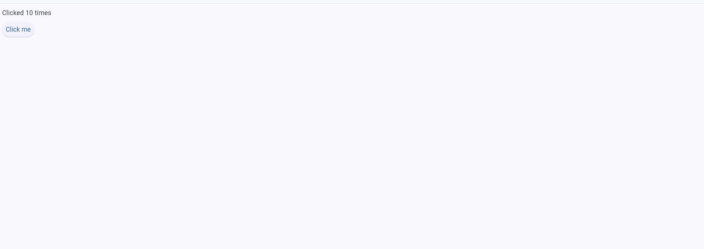

\# Flet Demo App


This is a simple demo application built with \*\*Flet\*\*. It displays a button on the screen, and every time you click the button, a counter increases and the current count is shown on the screen. For example: "Clicked 3 times", "Clicked 4 times", and so on.


\## Installation


1\. Make sure you have \*\*Python\*\* installed.

2\. Install the required package using \*\*pip\*\*. In your terminal or PyCharm terminal, run:


```bash

pip install "flet\[all]"

```


\## How to Use


1\. Open the project in \*\*PyCharm\*\* (or any Python IDE).

2\. Run the Python file that contains your app (for example, `app.py`). This will open a window showing the button.

3\. Click the button to increase the counter. The text on the screen will update with the number of times the button has been clicked.


\## Running with Docker🐳

You can also run the app using **Docker**:

Build the Docker image:


```bash

docker build -t my_flet_app .

```

Run the Docker container:

```bash

docker run -p 8500:8500 my_flet_app

```


Open your browser and go to http://localhost:8500 to see the app running.


\## About Flet


\*\*Flet\*\* is a Python framework that allows you to build interactive web, desktop, and mobile applications \*\*without needing to write JavaScript, HTML, or CSS\*\*. It provides a set of UI components (widgets) that you can use directly in Python, making it easier and faster to create GUI applications.


With Flet, you can:


\* Build desktop and web apps using Python only.

\* Handle UI events and updates in a reactive way.

\* Focus on Python code without worrying about front-end technologies.


\## Example Screenshot





